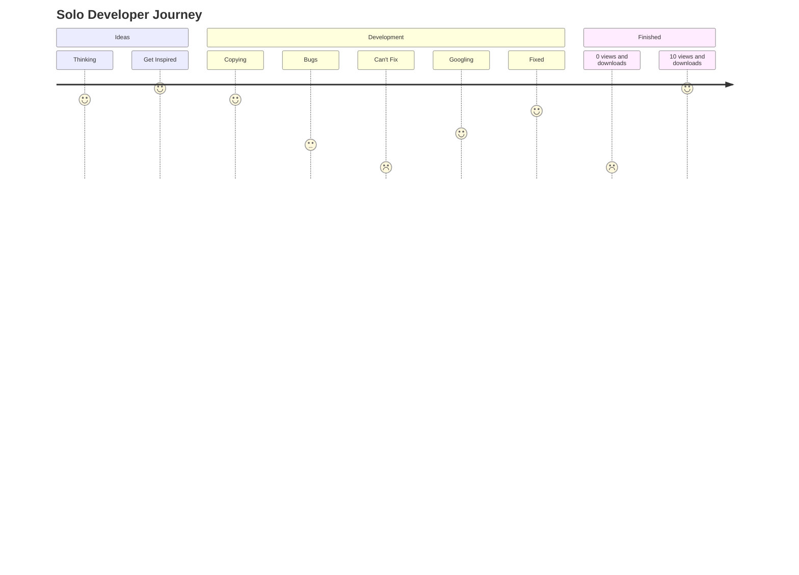

<html>
<body>
	<h2>About Me</h2>
	

		👋 Hi there! I'm a solo developer with hands-on experience in game development, web, app creation, and 3D projects. With strong programming skills and effective communication abilities, I'm ready to tackle any challenge. Let's collaborate and create something amazing together!
	

	<h2>Stats</h2>
	

  
  
	

  

<!--     

      
    

       -->

<h2>Journey</h2>

<h2>Contribution Graph</h2>

