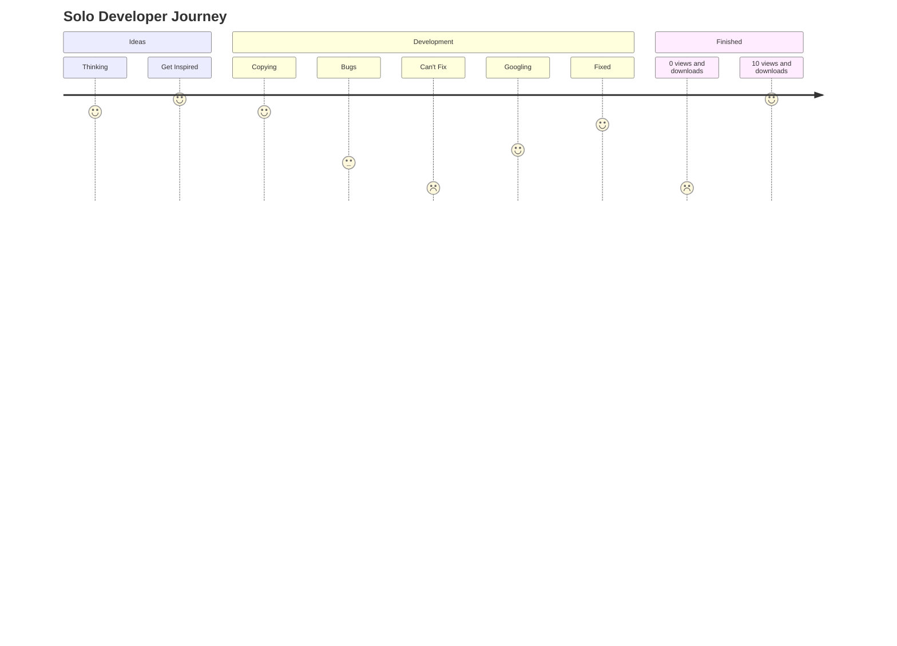

<html>
<body>
  

    

      
    

      

<h2></h2>

```mermaid
journey
	title Solo Developer Journey
	section Ideas
		Thinking: 7
		Get Inspired: 8
	section Development
		Copying: 7
		Bugs: 3
    Can't Fix: 1
    Googling: 4
    Fixed: 6
	section Finished
		0 views and downloads: 1
		10 views and downloads: 8
```

